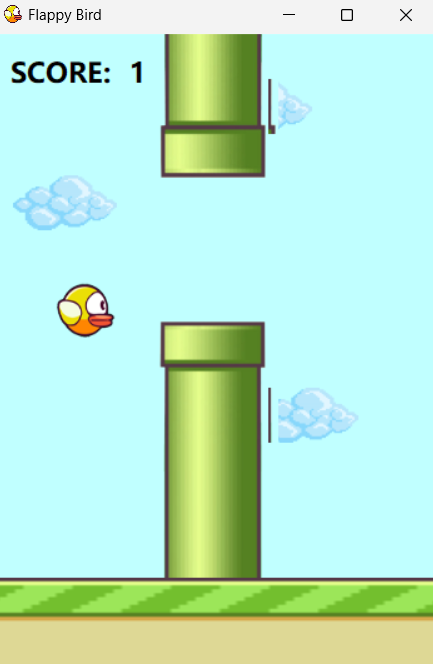

<h1>Flappy Bird</h1>

Bu proje de C# dili ile bir flappy bird oyunu yaptım.Bunu yaparken timer, picture box vb. windows form elemanlarını kullandım. </h2>

<h2>Oyunun Çalışır Hali</h2>

<h2>Oyunun Yanma Ekranı</h2>

